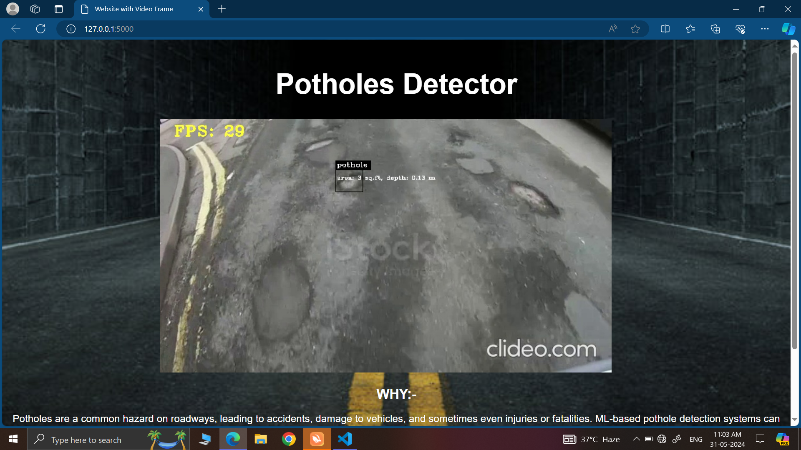

# Real-Time Pothole Detection using YOLOv4

A machine learning-based real-time pothole detection system that identifies potholes on the road while driving. This project uses YOLOv4 for object detection, measures the size of potholes, alerts the driver with a beep sound on positive detection, and stores the location of detected potholes. The project is developed using Google Colab for training and Flask for deployment.

## Features

- **Real-Time Detection**: Detects potholes in real-time using YOLOv4.
- **Size Measurement**: Measures the size of the detected potholes to assess severity.
- **Alert System**: Provides an audible beep alert when a pothole is detected.
- **Location Storage**: Stores the GPS location of detected potholes for future reference and analysis.
- **Flask Deployment**: The model is deployed using Flask for easy integration and accessibility.

## Screenshots

<div align="center">
  
</div>


## Installation

Follow these steps to set up and run the project locally:

### Prerequisites

- Python (latest version)
- Flask
- OpenCV
- YOLOv4 weights and configuration files
- Google Colab (for training the model)

### Setup

1. **Clone the Repository**
   ```bash
   git clone https://github.com/govindkumar20/Real-time-pothole-detection-MinorProject.git

2. **Locate the Repository**
   ```bash
   cd Real-time-pothole-detection-MinorProject 
3. **Run the Flask App**
   ```bash
   flask run
4. **Access the Application**
   ```bash
   Open your browser and go to http://127.0.0.1:5000 to see the application in action.


## Usage

- **Upload a Video Feed**: The app accepts real-time video feeds for detection.
- **Receive Alerts**: On detecting a pothole, the system provides an audible alert.
- **View Detection Details**: Information such as the size and location of the pothole will be displayed and stored.

## Model Training

The model was trained using Google Colab with the following steps:

1. **Data Preparation**: Annotated images of roads with potholes were used to train the model.
2. **YOLOv4 Configuration**: The YOLOv4 architecture was configured with appropriate hyperparameters.
3. **Training**: The model was trained using the annotated dataset on Google Colab, leveraging GPU acceleration for faster training.
4. **Evaluation**: The model's performance was evaluated using test images and video feeds.

## Deployment

- The trained model is deployed using Flask, which allows for easy integration with web-based applications and APIs.
- The application can be accessed through a web interface or REST API for real-time pothole detection.

## Contributing

Contributions are welcome! To contribute:

1. Fork the repository.
2. Create a new branch (`git checkout -b feature-branch`).
3. Make your changes.
4. Commit your changes (`git commit -m 'Add new feature'`).
5. Push to the branch (`git push origin feature-branch`).
6. Create a Pull Request.


## Contact

For any questions or feedback, feel free to reach out to me at `govindp231@gmail.com`.

